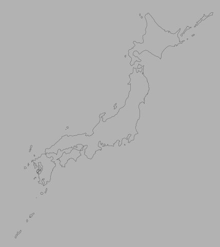
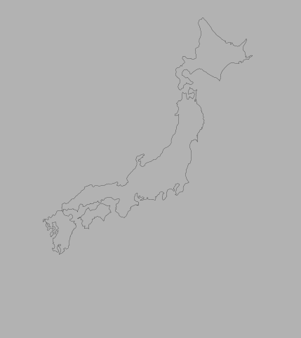
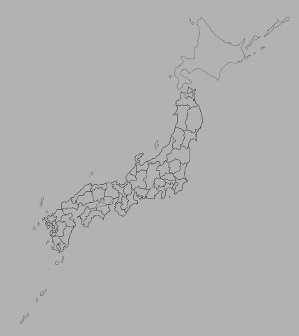

# Japan vector map 🗾
SVG vector map of Japan, complete with borders of each prefecture.

This map is free for you to download and use in personal and commercial projects and is licensed under a <a href="https://github.com/PA4KEV/japan-vector-map/blob/main/LICENSE">MIT License</a>.

The free design tool <a href="https://inkscape.org/">Inkscape</a> was used to draw this.

To convert to a <a href="https://react.dev/">React</a> component, you can use <a href="https://svg2jsx.com/">svg2jsx.com</a> to convert.

# Screenshots

## japan.svg



## japan-main-islands.svg


## japan-prefectures.svg



# Layers

```
prefectures
├──chubu
│  ├──aichi
│  ├──fukui
│  ├──gifu
│  ├──ishikawa
│  ├──nagano
│  ├──nigata
│  ├──toyama
│  ├──shizuoka
│  └──yamanashi
├──chugoku
│  ├──hiroshima
│  ├──okayama
│  ├──shimane
│  ├──tottori
│  └──yamaguchi
├──kansai
│  ├──hyogo
│  ├──kyoto
│  ├──mie
│  ├──nara
│  ├──osaka
│  ├──shiga
│  └──wakayama
├──kanto
│  ├──chiba
│  ├──gunma
│  ├──ibaraki
│  ├──kanagawa
│  ├──saitama
│  ├──tochigi
│  └──tokyo
├──kyuushuu-prefectures
│  ├──fukuoka
│  ├──kagoshima
│  ├──kumamoto
│  ├──miyazaki
│  ├──nagasaki
│  ├──oita
│  └──saga
├──shikoku
│  ├──ehime
│  ├──kagawa
│  ├──kochi
│  └──tokushima
└──touhoku
   ├──akita
   ├──aomori
   ├──fukushima
   ├──iwate
   ├──miyagi
   └──yamagata
islands
├──hokkaido
├──honshuu
├──kyuushuu-island
└──shikoku-island
other-islands
├──awaji
├──fukueshima
├──ikishima
├──kamikoshikijima
├──nagashima
├──nakadorishima
├──nemuro-sub-prefecture
│  ├──habomai
│  ├──shikotantou
│  ├──kunashiritou
│  └──etorofutou
├──nishinoshima
├──okinawa
├──okushirishima
├──oshima-kanto
├──oshima-kyuushuu
├──rebunshima
├──rishirishima
├──sado
├──shimokoshikijima
├──shimoshima
├──shodoshima
├──tanegashima
├──tokunoshima
├──toshima
├──tsushima
└──yakushima
```
# Versioning

This map uses a 2 number versioning, prefixed with a lowercase "v".

`<MAJOR>` versions include new features. For example, additional layers, vector paths or other features like colours.

`<HOTFIX>` versions include fixes such as spelling mistakes or minute changes to the vector paths.

Formatting: `v<MAJOR>.<HOTFIX>`

You can find all the released versions <a href="https://github.com/PA4KEV/japan-vector-map/releases">here</a>.
